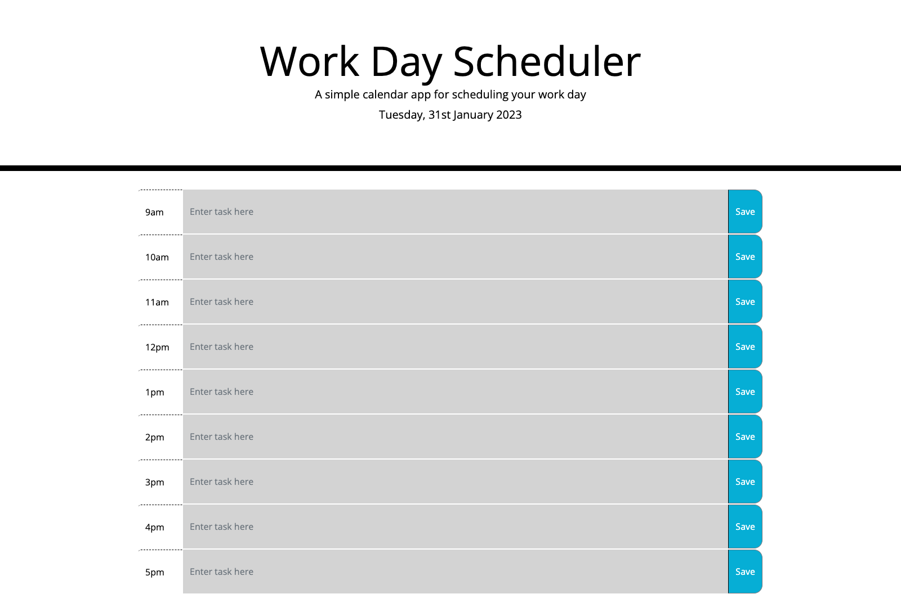

# Work-Day-Scheduler
An app to help plan a day's workload

## Description 

This is a simple application to help plan a day's workload. The working day (9am-5pm) is broken into hourly slots that have been created dynamically using jquery.

The deployed application can be found at:

https://naomimardon.github.io/Work-Day-Scheduler/

## Usage

Enter tasks into the timeblock for the hour when you want to complete that task. Click Save and the task will persist when the page is refreshed or closed and reopened.

The timeblock will change colour depending on the time of day - timeblocks in the past are grey, present is green, and future are red. The date at the top will also automatically update on a new day.

Here is a screenshot of the deployed application (taken after 6pm unfortunately so the different colours don't show):

## License

Please refer to the license in the repo.

---